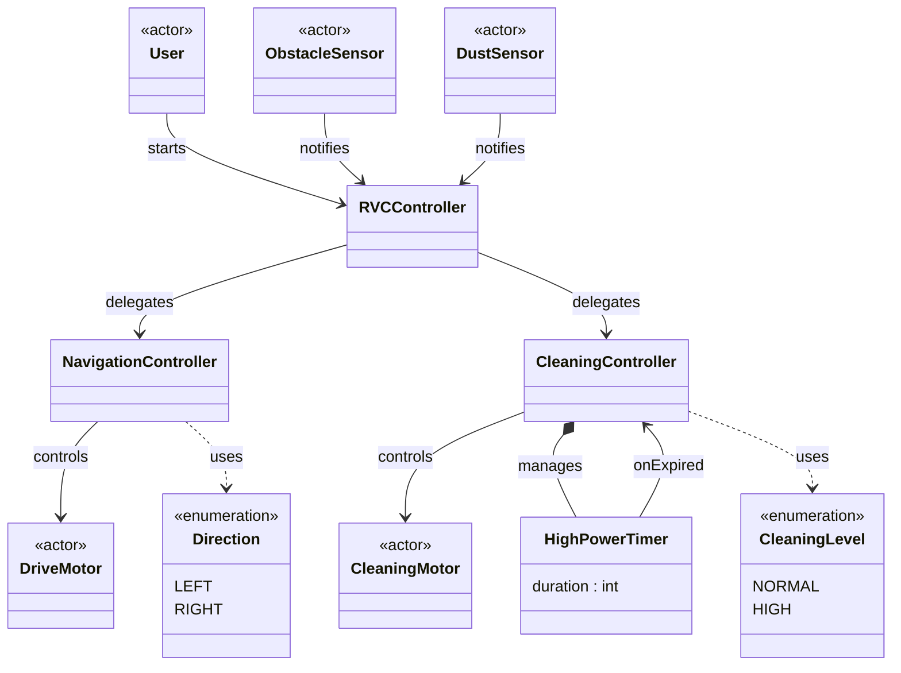

# 도메인 모델 (Domain Model)

## 개념 클래스 설명

### 외부 액터

액터는 시스템이 상태를 소유·관리하는 객체가 아니므로 필드를 표현하지 않는다.
센서 데이터는 시스템 오퍼레이션의 파라미터로 전달된다. [변경] ~~`sideStatus(available)`~~ 좌·우 각각 `sideStatus(LEFT, status)` / `sideStatus(RIGHT, status)` 두 번의 별도 호출로 분리된다. 우측은 `rotateRight()` 이후 전방 센서가 전달한다.

| 클래스 | 단일 책임 |
|--------|----------|
| User | 시스템을 시작시키는 주체 |
| ObstacleSensor | [변경] ~~장애물 감지 이벤트를 RVCController에 전달한다~~ 전방·좌측 장애물 감지 이벤트를 RVCController에 전달한다. sideStatus(LEFT)는 좌측 센서가 직접 전달하고, sideStatus(RIGHT)는 DriveMotor.rotateRight() 이후 전방 센서가 전달한다 (우측 전용 센서 없음). |
| DustSensor | 먼지 감지 이벤트를 RVCController에 전달한다 |
| DriveMotor | NavigationController의 주행 명령을 수행한다 |
| CleaningMotor | CleaningController의 청소 출력 명령을 수행한다 |

### 시스템 내부 객체

| 클래스 | 단일 책임 |
|--------|----------|
| RVCController | [변경] ~~시스템 오퍼레이션(start, frontObstacleDetected, [삭제], sideStatus, dustDetected)을 수신한다.~~ 시스템 오퍼레이션 (start, frontObstacleDetected, sideStatus(LEFT, status), sideStatus(RIGHT, status), dustDetected)을 수신하고 NavigationController·CleaningController에 위임한다. |
| NavigationController | DriveMotor를 제어한다. [변경] ~~방향 선택 로직(양쪽 여유 시 랜덤)을 포함한다~~ 방향 선택 로직(좌측 우선; 좌측이 막힌 경우에만 우측)을 포함한다. [추가] `rotateLeft()`로 우측 스캔 후 정면 복귀한다. |
| CleaningController | CleaningMotor를 제어하고 HighPowerTimer를 관리한다 |
| HighPowerTimer | 고출력 청소 지속 시간을 관리하고 만료 시 CleaningController에 통보한다 |

### 열거형

| 클래스 | 값 | 사용처 |
|--------|-----|--------|
| Direction | LEFT, RIGHT | NavigationController가 DriveMotor 회전 방향 결정 시 사용 |
| CleaningLevel | NORMAL, HIGH | CleaningController가 CleaningMotor 출력 지정 시 사용 |

## SRP 적용 근거

| 기존 | 문제 | 분리 후 |
|------|------|---------|
| RVCController가 이벤트 수신 + 주행 제어 + 청소 제어 + 타이머 관리를 모두 담당 | 변경 이유가 4가지 → SRP 위반 | RVCController(이벤트 수신·위임), NavigationController(주행), CleaningController(청소+타이머) 로 분리 |
