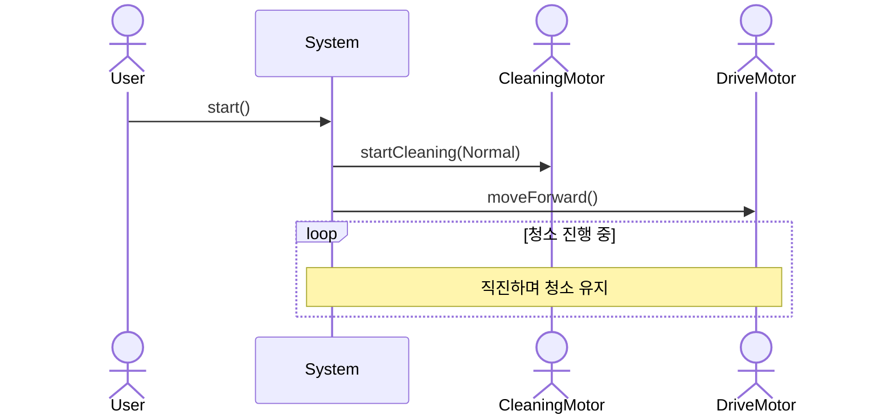

# SSD-001: 자동 청소 수행

- **연관 UC**: UC-001
- **관련 요구사항**: FR-01, SR-01, SR-02

## 시스템 시퀀스 다이어그램

```mermaid
sequenceDiagram
    actor User as User
    participant SYS as System
    actor CM as CleaningMotor
    actor DM as DriveMotor

    User->>SYS: start()
    SYS->>CM: startCleaning(Normal)
    SYS->>DM: moveForward()

    loop 청소 진행 중
        Note over SYS,DM: 직진하며 청소 유지
    end
```

## 시스템 오퍼레이션 목록

| 오퍼레이션 | 설명 |
|-----------|------|
| `start()` | User가 시스템을 시작시킨다 |
