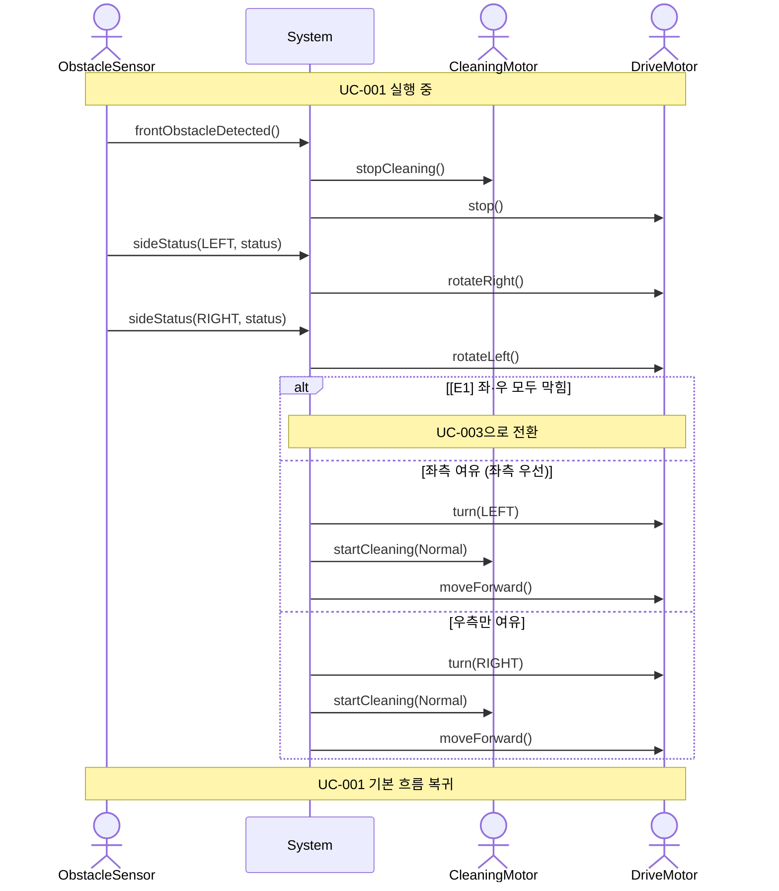

# SSD-002: 측면 장애물 회피

- **연관 UC**: UC-002
- **관련 요구사항**: FR-02, SR-03

## 시스템 시퀀스 다이어그램

## 시스템 오퍼레이션 목록

| 오퍼레이션 | 설명 |
|-----------|------|
| `frontObstacleDetected()` | 전방 장애물 감지 신호를 수신한다 |
| [변경] ~~`sideStatus(available)`~~ `sideStatus(LEFT, status)` | [변경] ~~여유 공간이 있는 방향(Direction)의 목록을 수신한다~~ 좌측 센서가 좌측 장애물 유무 신호를 전달한다. 회전 없이 직접 수신. |
| [추가] `sideStatus(RIGHT, status)` | DriveMotor.rotateRight() 이후 전방 센서(우측 향함)가 우측 장애물 유무 신호를 전달한다 (우측 전용 센서 없음). |
| [추가] `rotateLeft()` | sideStatus(RIGHT) 수신 후 DriveMotor를 정면으로 복귀시킨다. 이후 turn()이 항상 원래 전방 기준으로 동작하도록 보장한다. |
