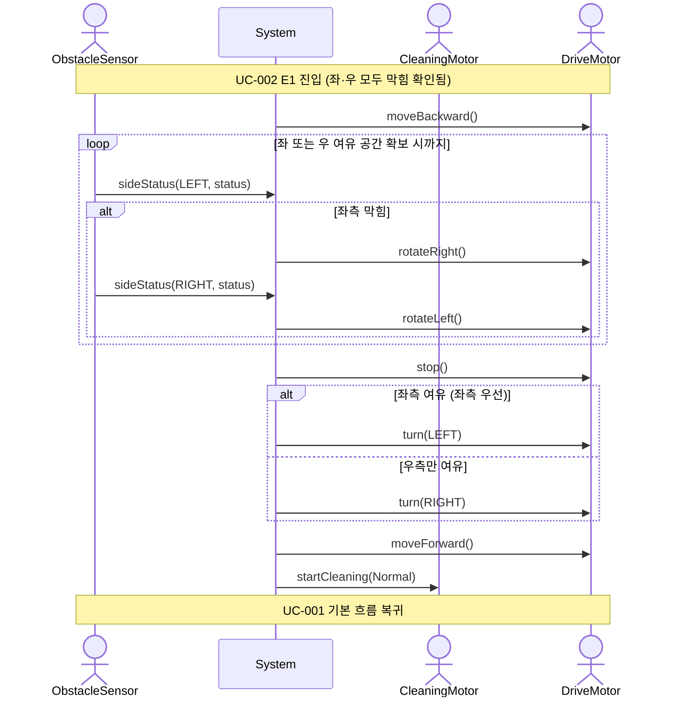

# SSD-003: 삼면 장애물 후진 회피

- **연관 UC**: UC-003
- **관련 요구사항**: FR-03, SR-04

## 시스템 시퀀스 다이어그램

## 시스템 오퍼레이션 목록

| 오퍼레이션 | 설명 |
|-----------|------|
| [삭제] | UC-002 내에서 sideStatus(LEFT) + sideStatus(RIGHT) 결과로 내부 판정 후 UC-003에 직접 진입. 별도 외부 오퍼레이션 없음. |
| [변경] ~~`sideStatus(available)`~~ `sideStatus(LEFT, status)` | [변경] ~~후진 중 좌·우 여유 공간 목록 수신~~ 후진 중 좌측 센서가 좌측 장애물 유무를 전달한다. 반복 수신. |
| [추가] `sideStatus(RIGHT, status)` | 좌측 막힘 시 rotateRight() 이후 전방 센서(우측 향함)가 우측 장애물 유무를 전달한다. 좌측 여유 확보 시 생략. |
| [추가] `rotateLeft()` | 좌측 막힘 시 sideStatus(RIGHT) 수신 후 DriveMotor를 정면으로 복귀시킨다. 루프 재진입 및 최종 turn() 모두 원래 전방 기준으로 동작하도록 보장한다. |
