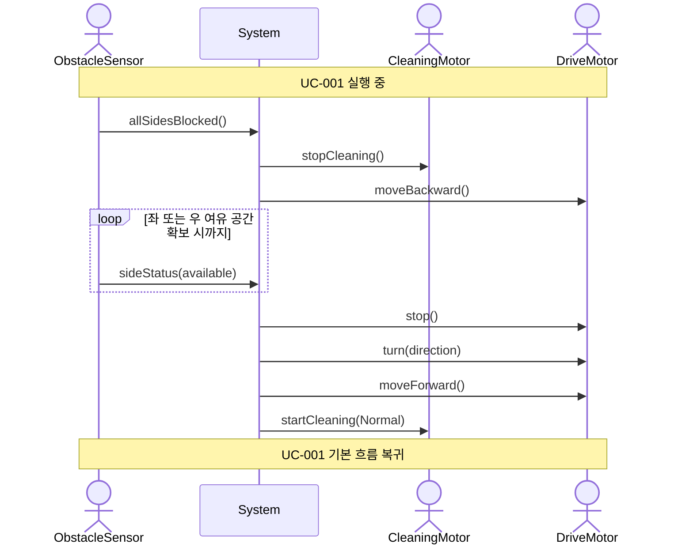

# SSD-003: 삼면 장애물 후진 회피

- **연관 UC**: UC-003
- **관련 요구사항**: FR-03, SR-04

## 시스템 시퀀스 다이어그램

## 시스템 오퍼레이션 목록

| 오퍼레이션 | 설명 |
|-----------|------|
| `allSidesBlocked()` | 전방·좌·우 모두 장애물 감지 신호를 수신한다 |
| `sideStatus(available)` | 여유 공간이 있는 방향(Direction)의 목록을 수신한다. 후진 중 반복 수신 |
