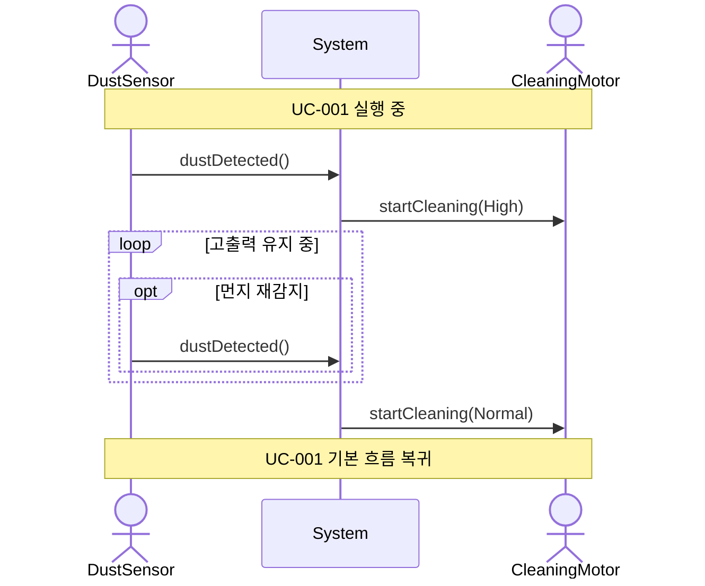

# SSD-004: 고출력 청소

- **연관 UC**: UC-004
- **관련 요구사항**: FR-04, SR-05

## 시스템 시퀀스 다이어그램

## 시스템 오퍼레이션 목록

| 오퍼레이션 | 설명 |
|-----------|------|
| `dustDetected()` | 먼지 감지 신호를 수신한다. 재감지 시 동일 오퍼레이션으로 타이머 초기화 |
