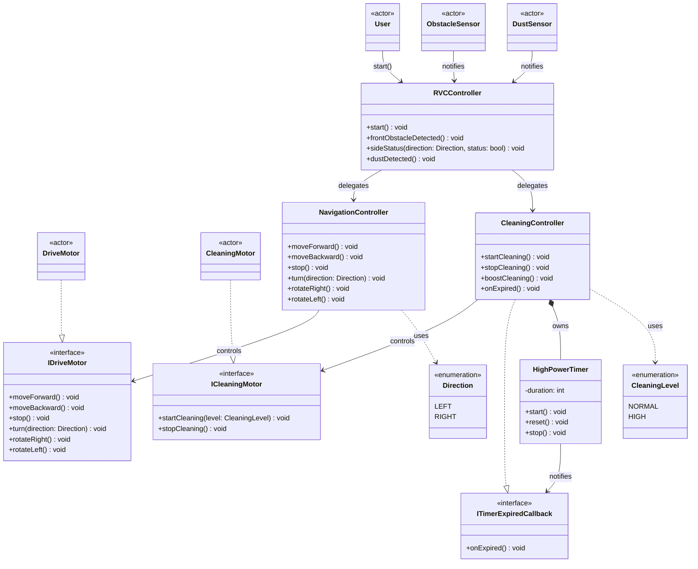

# 클래스 다이어그램 (Class Diagram)

## 다이어그램

## 클래스 책임 요약

### 외부 액터

| 클래스 | 역할 |
|--------|------|
| User | `start()` 호출로 시스템을 시작시키는 주체 |
| ObstacleSensor | [변경] ~~`frontObstacleDetected()`, `sideStatus(available)`, `allSidesBlocked()` 이벤트를 전달한다~~ `frontObstacleDetected()`, `sideStatus(LEFT, status)`, `sideStatus(RIGHT, status)` 이벤트를 전달한다. 우측은 `rotateRight()` 이후 전방 센서가 전달한다 (우측 전용 센서 없음). |
| DustSensor | `dustDetected()` 이벤트를 전달한다 |
| DriveMotor | `IDriveMotor`를 구현한다. NavigationController의 주행 명령을 수행한다 |
| CleaningMotor | `ICleaningMotor`를 구현한다. CleaningController의 청소 출력 명령을 수행한다 |

### 인터페이스

| 클래스 | 역할 |
|--------|------|
| IDriveMotor | 주행 모터 추상화. DIP 적용으로 NavigationController와 DriveMotor의 직접 의존을 차단한다 |
| ICleaningMotor | 청소 모터 추상화. DIP 적용으로 CleaningController와 CleaningMotor의 직접 의존을 차단한다 |
| ITimerExpiredCallback | 타이머 만료 콜백 추상화. HighPowerTimer↔CleaningController 순환 의존을 차단한다 |

### 시스템 내부 클래스

| 클래스 | 책임 |
|--------|------|
| RVCController | 시스템 오퍼레이션을 수신하고 NavigationController·CleaningController에 위임한다. sideStatus(LEFT)·sideStatus(RIGHT) 결과로 회피 방향을 결정한다 (LEFT 여유 시 LEFT 우선; LEFT 막힘 시에만 RIGHT). |
| NavigationController | [변경] ~~`IDriveMotor`를 제어한다. `turn(available)`에서 `Direction` 목록을 받아 방향 선택 로직(양쪽 여유 시 랜덤)을 수행한다~~ `IDriveMotor`를 제어한다. `turn(direction: Direction)`으로 단일 방향을 받아 회전한다. `rotateRight()`로 전방 센서를 우측으로 회전시킨다. 방향 선택(좌측 우선)은 RVCController가 결정한다. |
| CleaningController | `ICleaningMotor` 출력을 제어하고 HighPowerTimer를 관리한다. `ITimerExpiredCallback`을 구현하며 `onExpired()` 수신 시 출력을 NORMAL로 복구한다 |
| HighPowerTimer | 고출력 청소 지속 시간을 관리한다. 만료 시 `ITimerExpiredCallback.onExpired()`를 호출한다 |

### 열거형

| 클래스 | 값 | 사용처 |
|--------|-----|--------|
| Direction | LEFT, RIGHT | NavigationController가 DriveMotor 회전 방향 결정 시 사용 |
| CleaningLevel | NORMAL, HIGH | CleaningController가 CleaningMotor 출력 지정 시 사용 |

## 메서드 출처 (SD 추적)

| 메서드 | 출처 SD |
|--------|---------|
| `RVCController.start()` | SD-001 |
| `RVCController.frontObstacleDetected()` | SD-002 |
| [변경] ~~`RVCController.sideStatus(available: List<Direction>)`~~ `RVCController.sideStatus(direction: Direction, status: bool)` | SD-002, SD-003 |
| [삭제] ~~`RVCController.allSidesBlocked()`~~ | ~~SD-003~~ |
| `RVCController.dustDetected()` | SD-004 |
| `NavigationController.moveForward()` | SD-001, SD-002, SD-003 |
| `NavigationController.moveBackward()` | SD-003 |
| `NavigationController.stop()` | SD-002, SD-003 |
| [변경] ~~`NavigationController.turn(available: List<Direction>)`~~ `NavigationController.turn(direction: Direction)` | SD-002, SD-003 |
| [추가] `NavigationController.rotateRight()` | SD-002, SD-003 |
| [추가] `IDriveMotor.rotateRight()` | SD-002, SD-003 |
| [추가] `NavigationController.rotateLeft()` | SD-002, SD-003 |
| [추가] `IDriveMotor.rotateLeft()` | SD-002, SD-003 |
| `CleaningController.startCleaning()` | SD-001, SD-002, SD-003 |
| `CleaningController.stopCleaning()` | SD-002, SD-003 |
| `CleaningController.boostCleaning()` | SD-004 |
| `CleaningController.onExpired()` | SD-004 |
| `HighPowerTimer.start()` | SD-004 |
| `HighPowerTimer.reset()` | SD-004 |
| `HighPowerTimer.stop()` | SD-002, SD-003, SD-004 |
