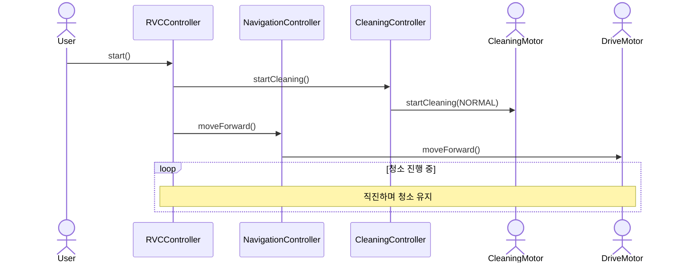

# SD-001: 자동 청소 수행

- **연관 UC**: UC-001
- **연관 SSD**: SSD-001

## 시퀀스 다이어그램

```mermaid
sequenceDiagram
    actor User as User
    participant RVC as RVCController
    participant NAV as NavigationController
    participant CLN as CleaningController
    actor CM as CleaningMotor
    actor DM as DriveMotor

    User->>RVC: start()
    RVC->>CLN: startCleaning()
    CLN->>CM: startCleaning(NORMAL)
    RVC->>NAV: moveForward()
    NAV->>DM: moveForward()

    loop 청소 진행 중
        Note over RVC,DM: 직진하며 청소 유지
    end
```
