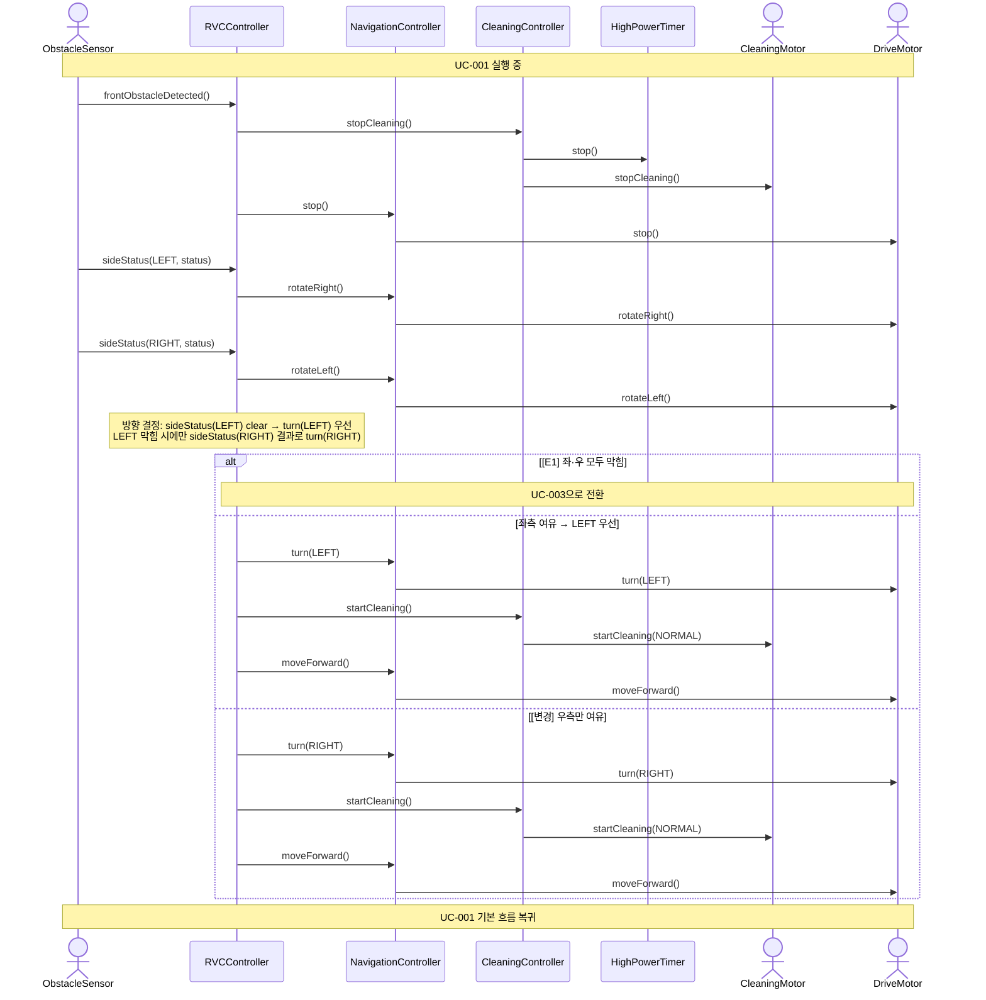

# SD-002: 측면 장애물 회피

- **연관 UC**: UC-002
- **연관 SSD**: SSD-002

## 시퀀스 다이어그램

## 설계 노트

- [변경] ~~`NavigationController.turn(available)` — `Direction` 목록을 받아 방향 선택 로직(랜덤 포함)을 NavigationController 내부에서 수행한다 (SRP)~~ `NavigationController.turn(direction: Direction)` — 단일 방향을 받아 회전한다. 방향 선택(좌측 우선)은 RVCController가 두 sideStatus 결과로 결정한 뒤 전달한다.
- [변경] ~~예외 흐름 E1 (좌·우 모두 막힘): `sideStatus([])` 수신 시(available이 빈 리스트) RVCController가 UC-003 흐름으로 전환한다~~ 예외 흐름 E1: sideStatus(LEFT, blocked) AND sideStatus(RIGHT, blocked) 수신 시 RVCController가 UC-003 흐름으로 전환한다.
- [추가] `rotateRight()` — RVCController → NavigationController → DriveMotor 순으로 위임하여 전방 센서를 우측으로 회전시킨다. sideStatus(LEFT) 수신 직후, sideStatus(RIGHT) 수신 직전에 호출한다.
- [추가] `rotateLeft()` — sideStatus(RIGHT) 수신 직후 정면으로 복귀한다. 이후 turn(LEFT)/turn(RIGHT)이 모두 원래 전방 기준으로 대칭 동작하도록 보장한다.
