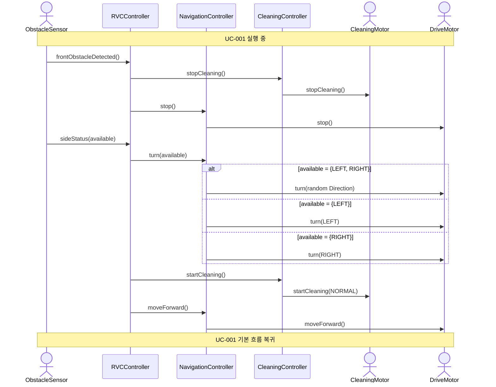

# SD-002: 측면 장애물 회피

- **연관 UC**: UC-002
- **연관 SSD**: SSD-002

## 시퀀스 다이어그램

## 설계 노트

- `NavigationController.turn(available)` — `Direction` 목록을 받아 방향 선택 로직(랜덤 포함)을 NavigationController 내부에서 수행한다 (SRP)
- 예외 흐름 E1 (좌·우 모두 막힘): `sideStatus([])` 수신 시(available이 빈 리스트) RVCController가 UC-003 흐름으로 전환한다
