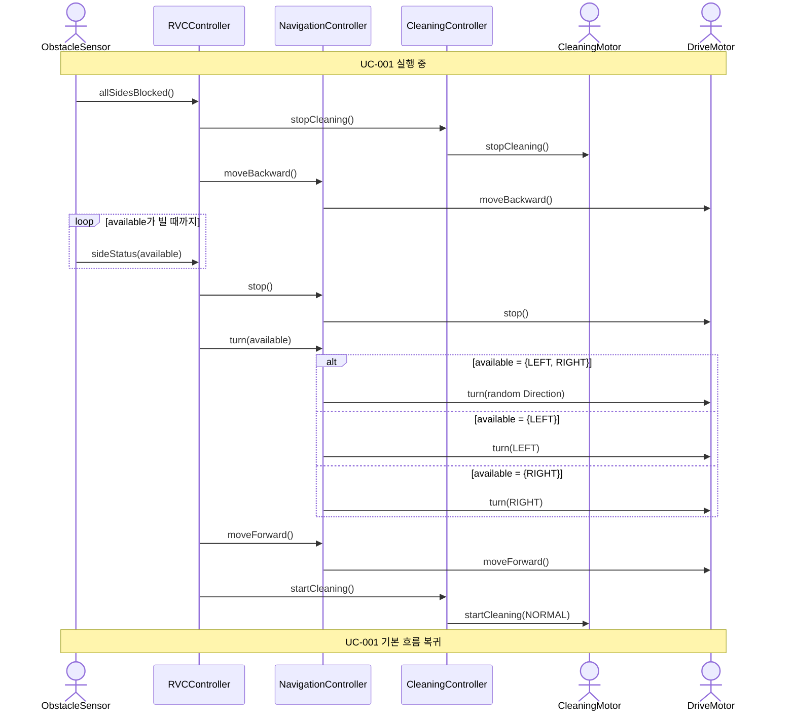

# SD-003: 삼면 장애물 후진 회피

- **연관 UC**: UC-003
- **연관 SSD**: SSD-003

## 시퀀스 다이어그램

## 설계 노트

- 청소 재개(`startCleaning`)는 전진 시작 이후에 호출한다 (UC-003 기본 흐름 8→9 순서)
- 후진 중 루프를 탈출하는 조건: `available`이 비어 있지 않을 때
- 방향 선택 로직은 SD-002와 동일하게 NavigationController 내부에서 수행한다
