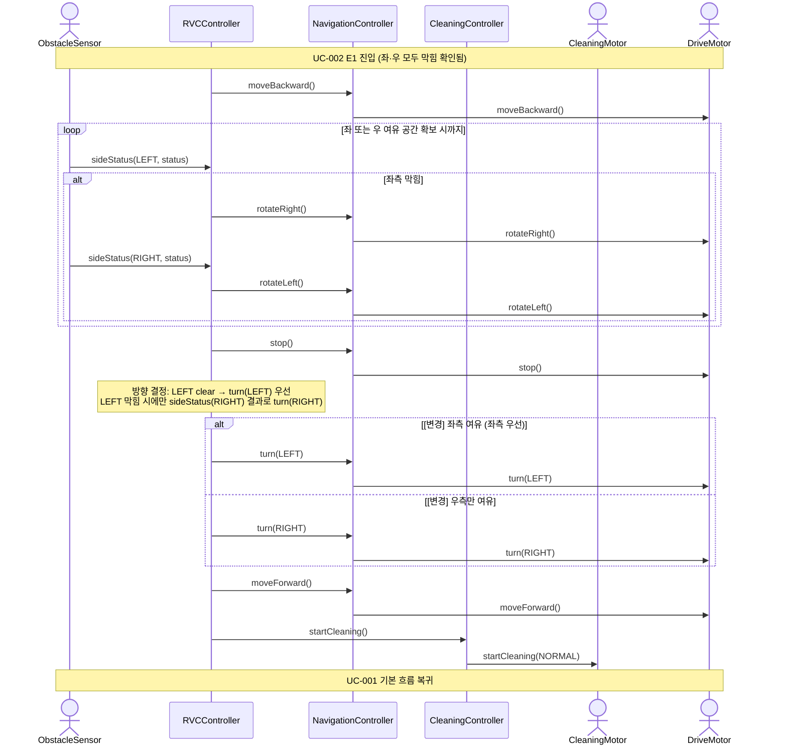

# SD-003: 삼면 장애물 후진 회피

- **연관 UC**: UC-003
- **연관 SSD**: SSD-003

## 시퀀스 다이어그램

## 설계 노트

- [변경] ~~청소 재개(`startCleaning`)는 전진 시작 이후에 호출한다 (UC-003 기본 흐름 8→9 순서)~~ 청소 재개(`startCleaning`)는 전진(`moveForward`) 이후에 호출한다 (UC-003 기본 흐름 9→10 순서).
- [변경] ~~후진 중 루프를 탈출하는 조건: `available`이 비어 있지 않을 때~~ 후진 중 루프 탈출 조건: sideStatus(LEFT, clear) 또는 sideStatus(RIGHT, clear) 중 하나라도 수신될 때.
- [변경] ~~방향 선택 로직은 SD-002와 동일하게 NavigationController 내부에서 수행한다~~ 방향 선택(좌측 우선)은 RVCController가 sideStatus 결과로 결정하고 NavigationController에 단일 방향을 전달한다.
- [추가] UC-003은 UC-002 E1에서 진입한다. CleaningMotor는 UC-002에서 이미 정지된 상태이므로 이 SD에서 별도의 stopCleaning 호출이 없다.
- [삭제] ~~`allSidesBlocked()` — ObstacleSensor → RVCController 외부 호출~~ (UC-002 내 두 sideStatus 결과로 내부 판정)
- [추가] 후진 중 좌측이 막혀있을 때만 rotateRight() → sideStatus(RIGHT) → rotateLeft() 순으로 우측을 확인하고 정면 복귀한다. 좌측 clear 시 즉시 좌회전하며 우측 확인을 생략한다.
