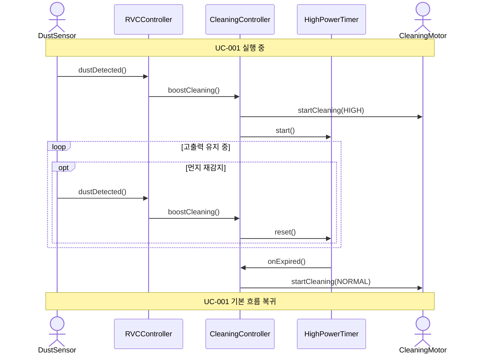

# SD-004: 고출력 청소

- **연관 UC**: UC-004
- **연관 SSD**: SSD-004

## 시퀀스 다이어그램

## 설계 노트

- `DriveMotor`는 UC-004 실행 중 주행 명령이 변경되지 않으므로 이 SD에 등장하지 않는다
- `HighPowerTimer`는 `CleaningController`가 composition으로 소유한다 (도메인 모델 참조)
- `boostCleaning()` 재호출 시 `CleaningMotor`에는 추가 명령을 보내지 않고 `HighPowerTimer`만 리셋한다
