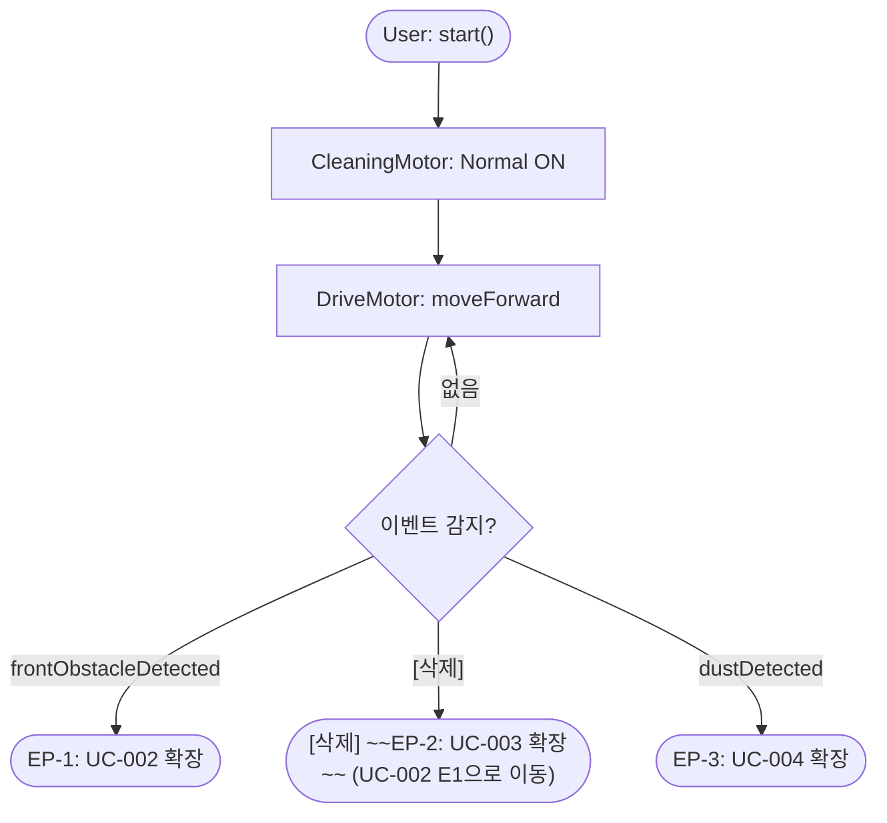

# UC-001: 자동 청소 수행

## 기본 정보

| 항목 | 내용 |
|------|------|
| Use Case ID | UC-001 |
| 이름 | 자동 청소 수행 |
| 액터 | User (Primary), DriveMotor (Secondary), CleaningMotor (Secondary) |
| 관련 요구사항 | FR-01, SR-01, SR-02 |
| 종류 | Base Use Case |

## 사전 조건 (Preconditions)
- User가 RVC를 시작시킨다.

## 사후 조건 (Postconditions)
- RVC가 CleaningMotor Normal 출력으로 직진하며 청소 및 닦기를 수행하고 있다.

## 기본 흐름 (Main Flow)

| 단계 | 액터/시스템 | 행위 |
|------|-----------|------|
| 1 | User | RVC를 시작시킨다. |
| 2 | System | CleaningMotor를 Normal 출력으로 가동한다. |
| 3 | System | DriveMotor를 전진 방향으로 구동한다. |
| 4 | System | 직진하며 바닥을 청소하고 닦는다. |
| 5 | System | 단계 4를 계속 반복한다. |

## 확장 포인트 (Extension Points)

| 확장 포인트 | 조건 | 확장 UC |
|------------|------|---------|
| EP-1 | [변경] ~~frontObstacleDetected AND (좌 OR 우 여유 있음)~~ frontObstacleDetected (좌·우 여유 공간 확인은 UC-002 내에서 sideStatus(LEFT) → rotateRight() + sideStatus(RIGHT) 순으로 수행) | UC-002 |
| [삭제] ~~EP-2~~ | | ~~UC-003~~ (UC-002 E1 예외 흐름으로 이동) |
| EP-3 | dustDetected | UC-004 |

## 활동 다이어그램

