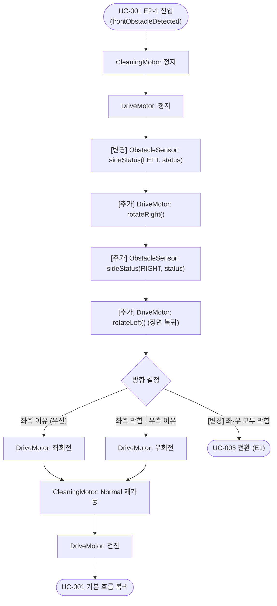

# UC-002: 측면 장애물 회피

## 기본 정보

| 항목 | 내용 |
|------|------|
| Use Case ID | UC-002 |
| 이름 | 측면 장애물 회피 |
| 액터 | ObstacleSensor (Primary), DriveMotor (Secondary), CleaningMotor (Secondary) |
| 관련 요구사항 | FR-02, SR-03 |
| 종류 | Extension of UC-001 (EP-1) |

## 사전 조건 (Preconditions)
- UC-001이 실행 중이다.
- 전방에 장애물이 감지되었다.
- [변경] ~~좌 또는 우 중 하나 이상의 방향에 여유 공간이 있다.~~ 좌·우 여유 공간 여부는 이 UC 내부에서 순차 확인한다 (진입 시점에 미결정).

## 사후 조건 (Postconditions)
- [변경] ~~RVC가 장애물이 없는 방향(좌 또는 우)으로 회전한 뒤, 청소를 재개하며 전진하고 있다.~~ (정상) 좌 또는 우로 회전 후 청소를 재개하며 전진한다. / (예외 E1) 좌·우 모두 막힌 경우 UC-003으로 전환한다.

## 기본 흐름 (Main Flow)

| 단계 | 액터/시스템 | 행위 |
|------|-----------|------|
| 1 | ObstacleSensor | 전방 장애물 감지 신호를 시스템에 전달한다. |
| 2 | System | CleaningMotor를 정지한다. |
| 3 | System | DriveMotor를 정지한다. |
| 4 | ObstacleSensor | [변경] ~~좌측 장애물 유무 신호를 시스템에 전달한다.~~ sideStatus(LEFT, status) — 좌측 센서가 좌측 장애물 유무 신호를 시스템에 전달한다. |
| 5 | System | [추가] DriveMotor에 rotateRight()를 명령한다 (전방 센서를 우측으로 회전). |
| 6 | ObstacleSensor | [추가] sideStatus(RIGHT, status) — 전방 센서(우측 향함)가 우측 장애물 유무 신호를 시스템에 전달한다. |
| 7 | System | [추가] DriveMotor에 rotateLeft()를 명령한다 (정면 복귀). 이후 turn()이 원래 전방 기준으로 동작하도록 보장한다. |
| 8 | System | [변경] ~~여유 있는 방향(좌 또는 우)으로 DriveMotor를 회전시킨다.~~ 좌측이 여유 있으면 좌회전한다. 좌측이 막히고 우측이 여유 있으면 우회전한다. |
| 9 | System | CleaningMotor를 Normal 출력으로 재가동한다. |
| 10 | System | DriveMotor를 전진 방향으로 구동한다. |
| 11 | | UC-001 기본 흐름 단계 4로 복귀한다. |

## 대안 흐름 (Alternative Flow)

### [변경] ~~A1: 좌·우 모두 여유 있을 때~~ A1: 좌측 여유 우선 선택
- [변경] ~~단계 5에서 좌·우 모두 여유 있으면 랜덤으로 방향을 선택하여 회전한다.~~ 단계 7에서 좌측이 여유 있으면 좌측을 우선으로 선택한다. 좌·우 모두 여유 있더라도 항상 좌측을 선택한다.

## 예외 흐름 (Exception Flow)

### E1: [변경] ~~회피 도중 전/좌/우 모두 막힘~~ 좌·우 모두 막힘 확인 후 UC-003 전환
- [변경] ~~단계 5 이전에 삼면이 모두 막힌 것이 감지되면 UC-003으로 전환한다.~~ 단계 7(rotateLeft 정면 복귀) 완료 후 sideStatus(LEFT)와 sideStatus(RIGHT) 모두 막힘이면 UC-003으로 전환한다.

## 활동 다이어그램

