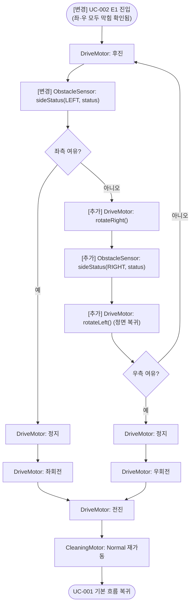

# UC-003: 삼면 장애물 후진 회피

## 기본 정보

| 항목 | 내용 |
|------|------|
| Use Case ID | UC-003 |
| 이름 | 삼면 장애물 후진 회피 |
| 액터 | ObstacleSensor (Primary), DriveMotor (Secondary), [추가] CleaningMotor (Secondary) |
| 관련 요구사항 | FR-03, SR-04 |
| 종류 | [변경] ~~Extension of UC-001 (EP-2)~~ Extension of UC-002 (E1) |

## 사전 조건 (Preconditions)
- UC-001 및 UC-002가 실행 중이다.
- [변경] ~~전방·좌·우 방향 모두에 장애물이 감지되었다.~~ UC-002 내에서 sideStatus(LEFT, blocked) 및 sideStatus(RIGHT, blocked) 가 모두 수신되어 좌·우 모두 막힘이 확인되었다 (UC-002 E1). 우측 전용 센서 없음.

## 사후 조건 (Postconditions)
- RVC가 후진 중 확보된 여유 방향(좌 또는 우)으로 회전한 뒤 전진하고 있다.

## 기본 흐름 (Main Flow)

| 단계 | 액터/시스템 | 행위 |
|------|-----------|------|
| 1 | (UC-002 E1) | [변경] ~~ObstacleSensor: 전방·좌측 장애물 감지 신호를 전달한다.~~ 좌·우 모두 막힘이 확인된 상태로 UC-002 E1에서 진입한다. (CleaningMotor는 UC-002 단계 2에서 이미 정지됨.) |
| 2 | System | DriveMotor를 후진 방향으로 구동한다. |
| 3 | ObstacleSensor | [변경] ~~좌측 장애물 유무 신호를 계속 전달한다.~~ sideStatus(LEFT, status) — 좌측 센서가 좌측 장애물 유무 신호를 전달한다. |
| 4 | System | [추가] 좌측이 여전히 막힌 경우 DriveMotor에 rotateRight()를 명령한다 (전방 센서를 우측으로 회전). |
| 5 | ObstacleSensor | [추가] sideStatus(RIGHT, status) — 전방 센서(우측 향함)가 우측 장애물 유무 신호를 전달한다. |
| 6 | System | [추가] rotateRight()를 호출한 경우 DriveMotor에 rotateLeft()를 명령한다 (정면 복귀). |
| 7 | System | 좌 또는 우에 여유 공간이 확보될 때까지 단계 2~6을 반복한다. |
| 8 | System | DriveMotor를 정지한다. |
| 9 | System | [변경] ~~여유 공간이 확보된 방향(좌 또는 우)으로 DriveMotor를 회전시킨다.~~ 좌측에 여유 공간이 확보된 경우 좌회전한다. 좌측이 막힌 경우에만 우측으로 DriveMotor를 회전시킨다. |
| 10 | System | DriveMotor를 전진 방향으로 구동한다. |
| 11 | System | CleaningMotor를 Normal 출력으로 재가동한다. |
| 12 | | UC-001 기본 흐름 단계 4로 복귀한다. |

## 대안 흐름 (Alternative Flow)

### [변경] ~~A1: 후진 중 좌·우 동시에 여유 공간 확보~~ A1: 후진 중 좌측 여유 공간 우선 선택
- [변경] ~~단계 5에서 좌·우 모두 동시에 해소되면 랜덤으로 방향을 선택하여 회전한다.~~ 단계 3에서 sideStatus(LEFT, clear)가 수신되면 단계 4~6을 건너뛰고 즉시 좌회전한다. 좌·우 모두 동시에 확보되더라도 항상 좌측을 우선으로 선택한다.

## 활동 다이어그램

