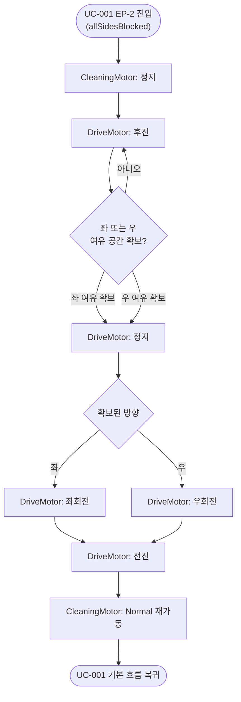

# UC-003: 삼면 장애물 후진 회피

## 기본 정보

| 항목 | 내용 |
|------|------|
| Use Case ID | UC-003 |
| 이름 | 삼면 장애물 후진 회피 |
| 액터 | ObstacleSensor (Primary), DriveMotor (Secondary) |
| 관련 요구사항 | FR-03, SR-04 |
| 종류 | Extension of UC-001 (EP-2) |

## 사전 조건 (Preconditions)
- UC-001이 실행 중이다.
- 전방·좌·우 방향 모두에 장애물이 감지되었다.

## 사후 조건 (Postconditions)
- RVC가 후진 중 확보된 여유 방향(좌 또는 우)으로 회전한 뒤 전진하고 있다.

## 기본 흐름 (Main Flow)

| 단계 | 액터/시스템 | 행위 |
|------|-----------|------|
| 1 | ObstacleSensor | 전방·좌·우 장애물 감지 신호를 시스템에 전달한다. |
| 2 | System | CleaningMotor를 정지한다. |
| 3 | System | DriveMotor를 후진 방향으로 구동한다. |
| 4 | ObstacleSensor | 좌/우 방향 장애물 유무 신호를 계속 시스템에 전달한다. |
| 5 | System | 좌 또는 우에 여유 공간이 확보될 때까지 단계 3~4를 반복한다. |
| 6 | System | DriveMotor를 정지한다. |
| 7 | System | 여유 공간이 확보된 방향(좌 또는 우)으로 DriveMotor를 회전시킨다. |
| 8 | System | DriveMotor를 전진 방향으로 구동한다. |
| 9 | System | CleaningMotor를 Normal 출력으로 재가동한다. |
| 10 | | UC-001 기본 흐름 단계 4로 복귀한다. |

## 대안 흐름 (Alternative Flow)

### A1: 후진 중 좌·우 동시에 여유 공간 확보
- 단계 5에서 좌·우 모두 동시에 해소되면 랜덤으로 방향을 선택하여 회전한다.

## 활동 다이어그램

