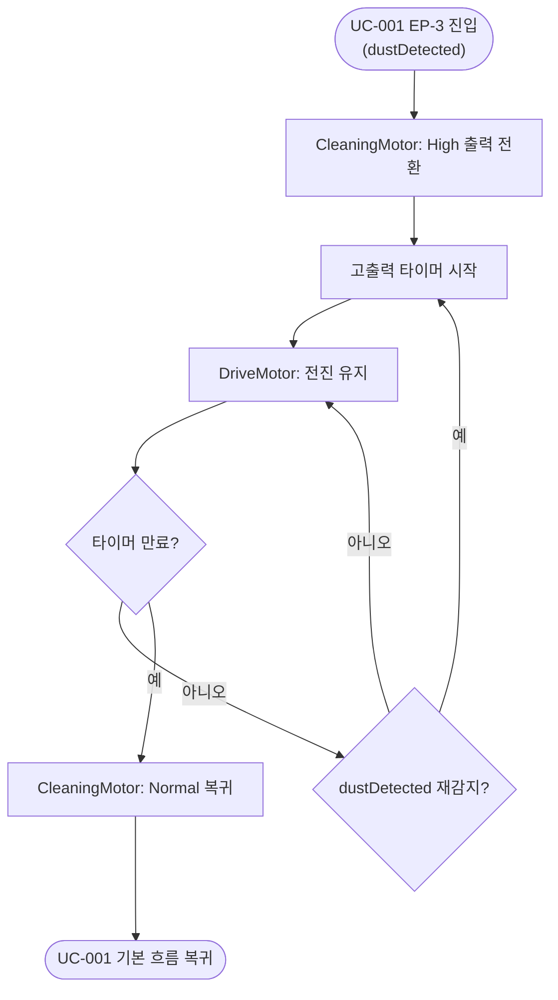

# UC-004: 고출력 청소

## 기본 정보

| 항목 | 내용 |
|------|------|
| Use Case ID | UC-004 |
| 이름 | 고출력 청소 |
| 액터 | DustSensor (Primary), CleaningMotor (Secondary) |
| 관련 요구사항 | FR-04, SR-05 |
| 종류 | Extension of UC-001 (EP-3) |

## 사전 조건 (Preconditions)
- UC-001이 실행 중이다 (CleaningMotor Normal 출력, DriveMotor 전진 중).
- DustSensor가 먼지를 감지하였다.

## 사후 조건 (Postconditions)
- CleaningMotor가 Normal 출력으로 복귀하였다.
- DriveMotor 전진은 UC-004 실행 중에도 중단 없이 유지되었다.

## 기본 흐름 (Main Flow)

| 단계 | 액터/시스템 | 행위 |
|------|-----------|------|
| 1 | DustSensor | 먼지 감지 신호를 시스템에 전달한다. |
| 2 | System | CleaningMotor 출력을 High로 전환한다. |
| 3 | System | 고출력 지속 타이머를 시작한다. |
| 4 | System | DriveMotor 전진을 유지한다 (주행 중단 없음). |
| 5 | System | 타이머가 만료될 때까지 단계 4를 반복한다. |
| 6 | System | CleaningMotor 출력을 Normal로 복귀시킨다. |
| 7 | | UC-001 기본 흐름 단계 4로 복귀한다. |

## 대안 흐름 (Alternative Flow)

### A1: 고출력 청소 중 장애물 감지
- 단계 4 중 장애물이 감지되면 UC-002 또는 UC-003을 수행한다.
- 장애물 회피 완료 후 남은 타이머 시간만큼 고출력 청소를 계속하고 단계 6으로 진행한다.

### A2: 고출력 청소 중 추가 먼지 감지
- 단계 5 중 먼지가 재감지되면 타이머를 초기화하여 단계 3부터 재시작한다.

## 활동 다이어그램

