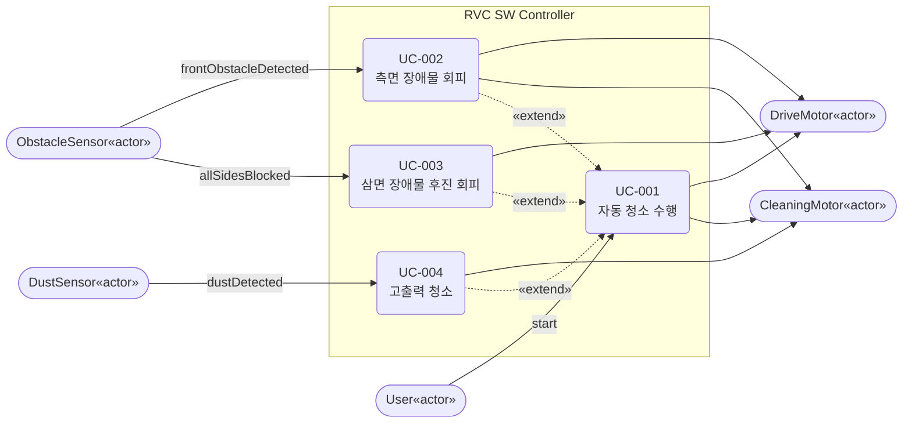
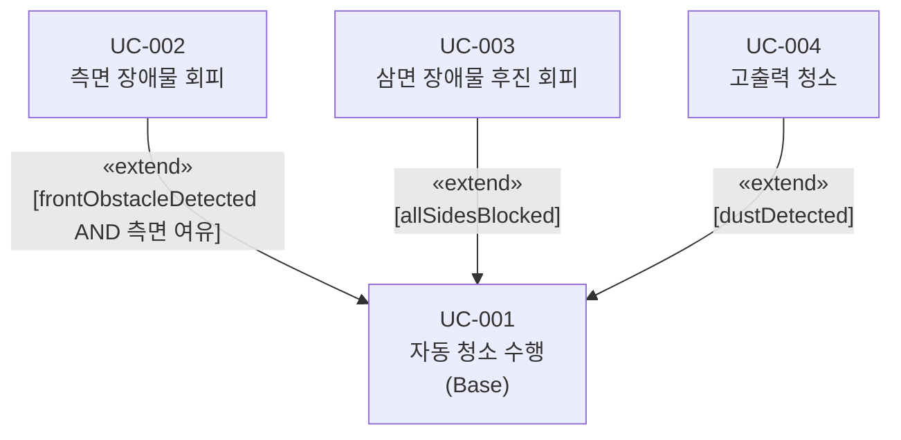

# Use Case 목록 (Use Cases)

## 1. 액터 (Actors)

| 액터 | 종류 | 설명 |
|------|------|------|
| User | Primary Actor | 시스템을 시작시키는 주체 |
| ObstacleSensor | Primary Actor | 전방/좌/우 장애물 감지 신호를 시스템에 전달한다 |
| DustSensor | Primary Actor | 먼지 감지 신호를 시스템에 전달한다 |
| DriveMotor | Secondary Actor | 시스템으로부터 주행 명령(전진/후진/회전/정지)을 수신한다 |
| CleaningMotor | Secondary Actor | 시스템으로부터 청소 출력 명령(Normal/High/정지)을 수신한다 |

## 2. Use Case 다이어그램

## 3. Use Case 목록

| Use Case ID | 이름 | 관련 액터 | 관련 요구사항 | 상세 문서 |
|-------------|------|-----------|--------------|-----------|
| UC-001 | 자동 청소 수행 | User, DriveMotor, CleaningMotor | FR-01 | [UC-001.md](UC-001.md) |
| UC-002 | 측면 장애물 회피 | ObstacleSensor, DriveMotor, CleaningMotor | FR-02 | [UC-002.md](UC-002.md) |
| UC-003 | 삼면 장애물 후진 회피 | ObstacleSensor, DriveMotor | FR-03 | [UC-003.md](UC-003.md) |
| UC-004 | 고출력 청소 | DustSensor, CleaningMotor | FR-04 | [UC-004.md](UC-004.md) |

## 4. Use Case 요약

### UC-001: 자동 청소 수행
User가 시스템을 시작하면 CleaningMotor를 Normal 출력으로 가동하고 DriveMotor로 직진하며 바닥을 청소하고 닦는다. 이 동작은 시스템의 기본(Base) 흐름이며, 나머지 UC는 이를 확장(extend)한다.

### UC-002: 측면 장애물 회피
전방에 장애물이 감지되고 좌 또는 우 중 여유 공간이 있을 때, 청소를 일시 정지하고 여유 있는 방향으로 회전한 뒤 청소를 재개하며 전진한다.

### UC-003: 삼면 장애물 후진 회피
전방·좌·우 모두 장애물이 감지될 때, 후진하며 좌 또는 우 중 하나의 장애물이 해소될 때까지 후진을 유지한다. 여유 공간이 확보되면 해당 방향으로 회전하여 전진한다.

### UC-004: 고출력 청소
먼지가 감지되면 CleaningMotor 출력을 High로 높이고, 일정 시간이 경과하면 자동으로 Normal 출력으로 복귀한다. 주행은 중단 없이 계속한다.

## 5. Use Case 간 관계

